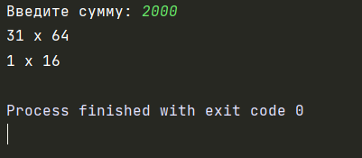
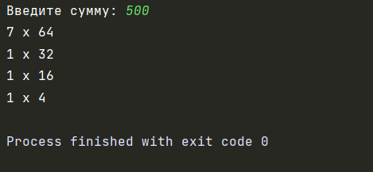
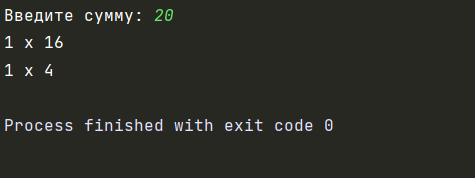

## Автор: 
Шляпникова Елена

## Описание:
Программа просчитывает, какой комбинацией купюр можно составить введенную сумму

## Тесты:

## Инструкция:

Для использования программы необходимо выполнить следующие действия:
1) Запустить программу
2) Ввести сумму, которую нужно обработать
3) Получить результат выполнения

## Комментарий:

Для разработки данной программы использовалась среда разработки PyCharm.
Для открытия файла исходного кода можно использовать любую среду разработки.